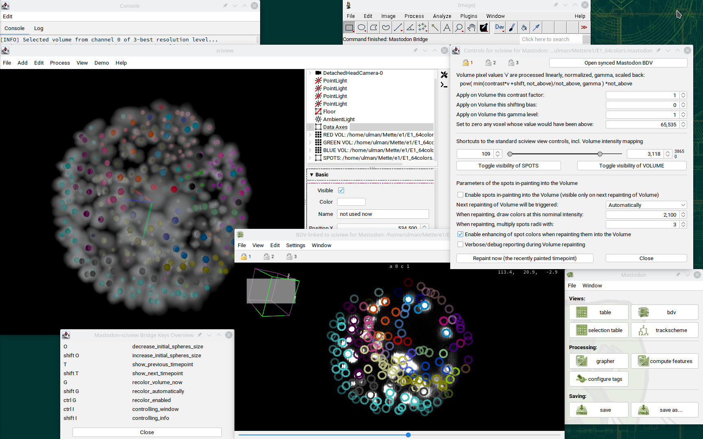
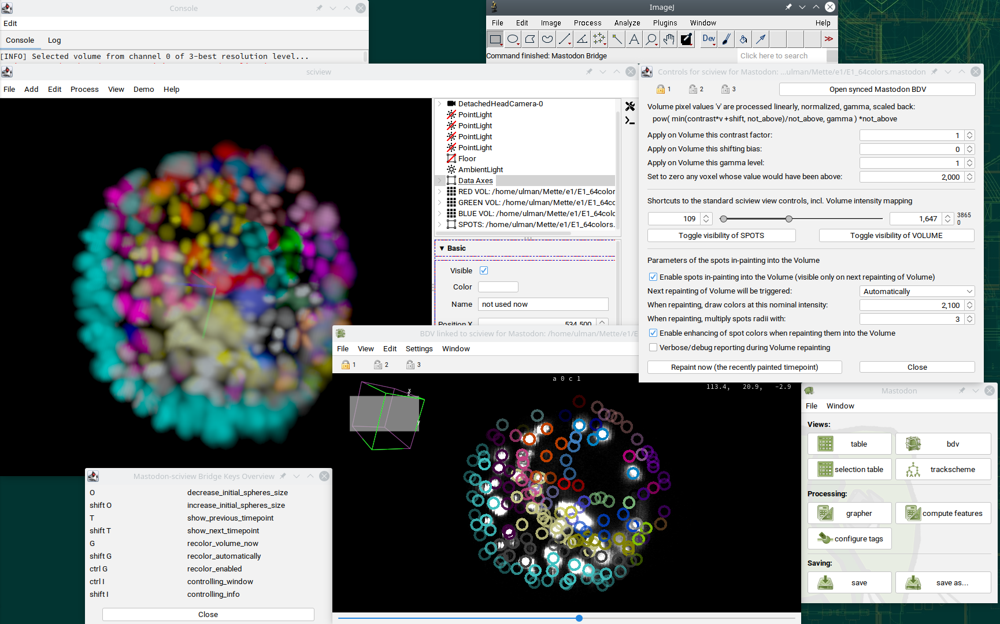
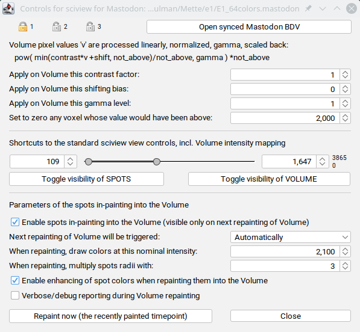

# Mastodon-sciview Bridge (take2)
This is a reincarnation of [an earlier project `mastodon-sciview`](https://github.com/mastodon-sc/mastodon-sciview/) by [`xulman`](https://github.com/xulman) and [`RuoshanLan`](https://github.com/ruoshanlan).
It aims to display data from [Mastodon](https://github.com/mastodon-sc) also in [sciview (and scenery)](https://github.com/scenerygraphics/sciview).

The repository was started during the [scenery and sciview hackathon](https://imagesc.zulipchat.com/#narrow/stream/391996-Zzz.3A-.5B2023-06.5D-scenery.2Bsciview-hackathon-dresden)
in Dresden (Germany) in June 2023, but most of the code was contributed by [`xulman`](https://github.com/xulman) shortly afterward.

## The standard view
Here's an example of data inspection that can be made possible via this project. It features volumetric rendering overlaid with colored spheres.
The pixel data, spheres and their color come from the Mastodon, the latter in particular shows colors assigned to individual cell tracks:

## The in-painting view
In an attempt to simplify a little the standard view, the spheres can be not displayed and instead
pixels in their vicinity will take the color. This is called **in-painting** in this project, and can look like in the following example:

Needless to say, many things are adjustable via the controls panel, shown in top right.

# How to use
Since this shall open Mastodon data also in the sciview, one should first open some project in Mastodon and then in Mastodon click `Window -> New sciview`.

## Opening
Two dialog windows shall pop up.

The left one opens the first and asks:
- Whether the content shall be displayed in an already opened sciview window (if there's one),
or whether it definitively should be displayed in a separate sciview window.
- Whether the controls panel should be opened right away (if not, one can always open it later, usually with Ctrl+I).
- Which pixel data channel should be used for the volumetric pixel display in sciview.

Afterward, the right-hand side dialog opens and asks:
- Which resolution level, from the chosen pixel data channel, should be used.

Since pixel data can be additionally, on-the-fly copied and modified (e.g., when the in-painting is in effect),
it is advisable to start first with the lowest resolution available, and potentially reopen again with higher resolution
later if the data size and performance of your system are handling everything smoothly.

## Displayed content
When sciview is started, it displays chosen pixel data via volumetric rendering, the spheres (referred to as *SPOTS*), and
orientation axes (with the meaning that red, green, and blue point in the positive directions of the *Mastodon* x-, y-, and z-axis, respectively).

One can (temporarily) hide some of the displayed content or alter its appearance by using
the functionalities of sciview itself.

## Viewing options
However, controls relevant to the tracking context (plus convenience shortcut controls) are put together in the controls panel.
The panel, for example, summarizes [how (copies of the) pixel data are additionally processed in order to improve their appearance](doc/CONTROLS.md),
and allows to adjust parameters of it:

In its middle section, convenience shortcuts to the sciview controls are made available, while, at the bottom, in-painting controls are grouped.

Opening a new Mastodon's BDV (BigDataViewer) window via the panel's top-right button `Open synced Mastodon BDV` will make sciview's view follow
that BDV's view. That said, the change of *view angle* (but not panning nor zooming) in that BDV is immediately applied also to sciview, which makes
sciview look at the same piece of data. Enabled colors (tags) in that BDV are also immediately effective in sciview. Last but not least, selecting
a spot in Mastodon selects it also in the sciview and displays it's sphere as a wire-frame (not as solid sphere as it is usually). This works also
in the opposite direction, selecting a sphere in sciview foces Mastodon to focus on the counterpart spot. Which time point is currently displayed
is also linked between the two.

Additionally, the controls panel contains the same three locks as it is in Mastodon, and it works as expected.

## Keyboard shortcuts
The summary of the currently available keyboard keys can be opened into a separate, non-model window by selecting the menu `Help -> Mastodon Bridge` in sciview.

Sometimes, it is necessary to (right) mouse click into the main viewing pane of the sciview to make it react to key presses
(technically, to assure it's focused and receives OS events). 

# How to compile and deploy
[Please, refer to `doc/COMPILE.md`](doc/COMPILE.md)
