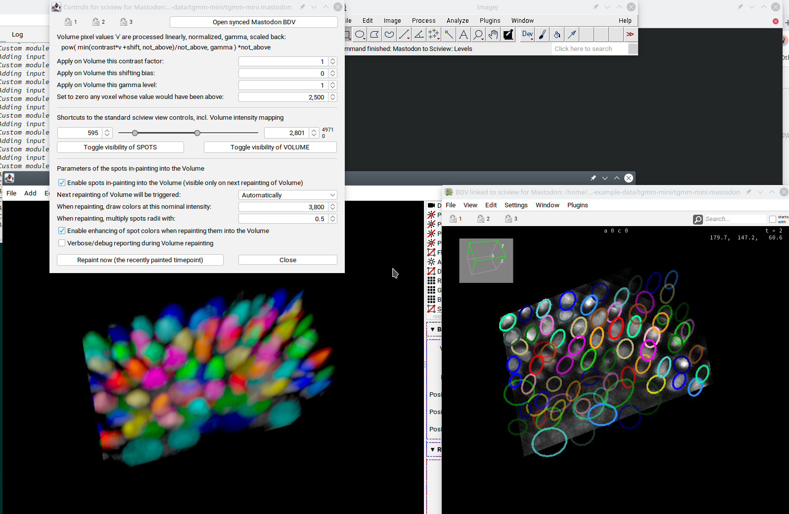

# The mangling of pixels before they are displayed in sciview

What originally was a technical necessity, the full copy of the relevant pixel data (that is, pixels
from the chosen resolution for the currently displayed time point) into one re-used memory
allows us to modify the data (pixels) before they are displayed.
This enabled us to implement *gamma correction* as well as *track colors in-painting*.

An illustrative screenshot of the [Mastodon freely available example project with pixel data](https://github.com/mastodon-sc/mastodon-example-data)
could look like this:

## Gamma correction, and more...
First we need to understand what happens to pixel values on their way to the screen:

- The original pixel values are linearly stretched, i.e. multiplied by "contrast factor".
- The values are then shifted by adding a constant "shifting bias".
- The values are then clipped to an interval <0 ; "not_above">,
  so basically any value above this "not_above" threshold is set to the threshold value.
- If gamma value is different than 1.0, then
  - because of the nature of the [gamma correction](https://en.wikipedia.org/wiki/Gamma_correction) computing,
    the pixel values need to normalized into an interval <0 ; 1>, and
  - the values are then raised to the power "gamma level" (which leaves them in the interval <0 ; 1>), and
  - are stretched back to the original full interval < 0 ; "not_above">.

In this way, the pixel values are guaranteed to be between 0 and the "not_above" threshold,
occupying a certain low-band from the full displayable capacity <0 ; 65535>.

This information could be useful for the shortcuts middle section of the Controls panel,
in particular for the "Volume intensity mapping" range slider. The job of this slider is to
define how the pixels will be mapped onto the screen:

- All pixel values below the lower/left side of the slider will be mapped to black.
- All pixel values above the higher/right side of the slider will be mapped to white.
- Pixel values in between will be proportionally mapped to the shades of gray (from black till white).

It seems natural then to set the lower/left side of the slider to 0, and the higher/right part
of it to the "not_above" threshold. However, useful pixel intensities are usually in an even
narrower band and thus this slider is here to fine tune.

---

Btw, to adjust the sliding range (which is noted on the right with the two numbers above each other)
of the slider itself, press `Ctrl` and place mouse pointer to the right half of the slider, then press
left mouse button and keep holding it while moving the mouse pointer left-right to adjust the higher/right
side bound of the slider. Using left half of the slider area will control the lower/left bound of the slider.

## The colors in-painting in more detail
The in-painting introduces color to otherwise gray image ('cause the image was showing a single channel) by
creating disproportion to the pixel values in the Red, Green and Blue sciview volumes. So, if a pixel is to be
*colorized* with R,G,B, each being from the interval <0 ; 1>, it's simply multiplied with these components.

However, if the R,G,B triplet shall represent a dim color, that is, a color with rather low values in all three
components, this would basically turned the colorized pixel to a very faint, hardly visible one.
The option "Enable enhancing of spot colors" modifies the R,G,B to the brightest possible, same color (hue).
It prevents (to a limited extent) the colorized pixels to became very faint.

Be it as it may, the R,G,B components are inevitably always lower-or-equal than 1.0.
So multiplying the pixel values with them inevitably decreases the pixel brightness.
In order to counter balance this effect, "nominal intensity" for the colorized pixels is considered.
Technically, it multiplies the pixels with a factor of "nominal intensity" / "not_above" in an attempt
to elevate the brightest pixels (those at values of "not_above") to the "nominal intensity".
It is therefore desirable to set the "nominal intensity" (much) higher than the "not_above" threshold.

The color is then taken from Mastodon data. In particular, from the "synced Mastodon BDV" window and there
currently enabled tag set (via the BDV -> View -> Coloring -> some_color_scheme).

When a color is decided for a *SPOT*, it's radius is multiplied with "spots radii with" factor to define
a spherical region around that *SPOT*'s centre and all pixels within this region are colorized.
If this factor is set very high, it may be colorizing even nearby pixels that semantically belong to another cell (tracked object).
